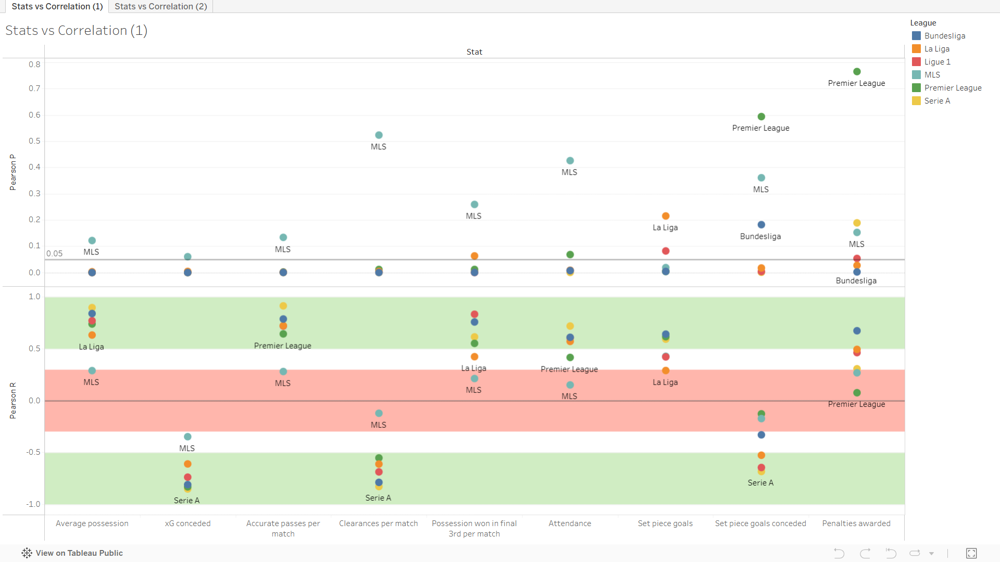
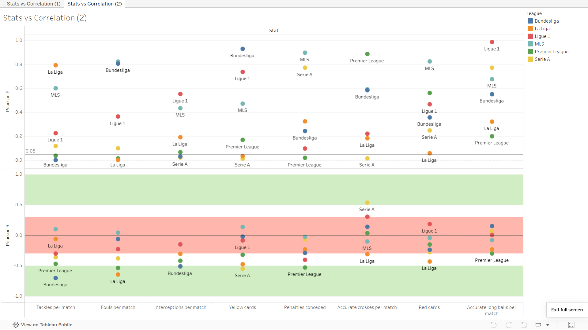

# Correlation Between Stats and Success Across Leagues
## by Heechan Han

## Contents
- [Introduction](#introduction)
- [Conclusion](#conclusion)

## Introduction
This project aims to explore various football stats that best correlate with success, and compare how this correlation differs across different stats across different leagues. The general idea is as follows. We will take football club statistics scraped from my from [FotMob data scraper](https://github.com/hhan31415/fotmob-scraper) for six different leagues in the 2025-2026 season: the Big 5 leagues (i.e. Premier League, La Liga, Bundesliga, Serie A, Ligue 1) and the MLS. These statistics include xG, average possession, corners taken, clearences, etc. 

Then for each league, we will use R to compute and compile the correlation between total points in the league season and each of these statistcs. The correlation data will be given by the Pearson's and Spearman's correlation tests. Removing obvious correlating stats like wins and goals scored, we want to see if for each league, there are any non-trivial statistics that correlate highly to on-field success.

We then want to compare these correlation numbers across various leagues to explore if there is any meaningful difference between the games being played across Europe and the US. In particular, we want to see if there are statistics which have a highest variablity of R values across leagues while still maintaining significance. We will later see that a few non-trivial examples can pop up.

## Computing Correlation

## Comparing Leagues
Now that we have the correlation values for each statistic, we want to compare these values across leagues to see if there are any meaningful differences between the leagues. In particular, the following are some examples of interesting observations we may look for:
- Statistics not directly connected to wins or goals which have a significant, high correlation across multiple leagues,
- Stats which have high correlation and significant p-values in some leagues, but low correlation in others,
- Stats which have positive correlation in some leagues but negative correlation in others.

To do this, I combined all the previous csvs containing correlation data into one massive table grouping by stats, then computed various values like range of R values and average R values across the leagues. For example, the following is one output for the stat "Accurate long balls per match":
```
   stat                           min_r   max_r  range  mean_r    min_p    max_p   mean_p min_significant max_significant
   <chr>                          <dbl>   <dbl>  <dbl>   <dbl>    <dbl>    <dbl>    <dbl> <lgl>           <lgl>          
 1 Accurate.long.balls.per.match -0.299   0.151  0.450  -0.0647 2.00e- 1 9.86e- 1 5.84e- 1 FALSE           FALSE          
```
which tells us that the stat "accurate long balls per match" has a decent range of R values with weak correlation across the 5 major leagues + the MLS. You can check the full table [here](output/team_stat_variability.csv) and the R file for this section [here](other_R_files/compare_leagues.R).

Of course, this itself still may not be all that interesting, if the correlation is not significant. Indeed, the above statistic has a minimum p-value of 0.2 across the six leagues, so the correlation not significant. This shows us that throughout all six leagues, accurate long balls has basically shows no real evidence of a relationship with on-pitch success. 

In fact, accurate long balls per match is one of two stats which show no significance (p < 0.5) across all six leagues, along with red cards. All other stats have at least one league which shows significance. Checking the table also shows that there are thirteen stats which show sigificance for _all_ six leagues; most of these are stats that obviously seem to have a real relationship with success like Goal difference and xG, although there are some more interesting stats like corners and big chances missed.

In general, these thirtheen significant stats also have a generally strong correlation across all leagues, so we can take them as the "obvious" correlating stats in Europe and the MLS. Let us now turn to the stats which vary in correlation and significance across the leagues. We look at the remaining 17 stats and analyze the R and p-values for each stat across each league to see which league may be an outlier. The table for this data is [here](output/league_top_variable_stats.csv). The following is a Tableau visualization of the table:


The link to the relevant Tableau dashboard is [here](https://public.tableau.com/app/profile/heechan.han/viz/Top5LeaguesMLSCorrelationBetweenStatsandSuccess/StatsvsCorrelation1).

## Average Possession

## Clearances

## Possession Won in the Final Third

## Conclusion
